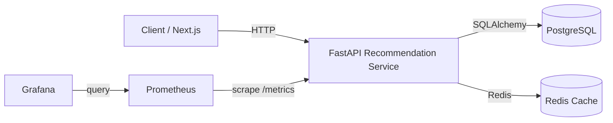
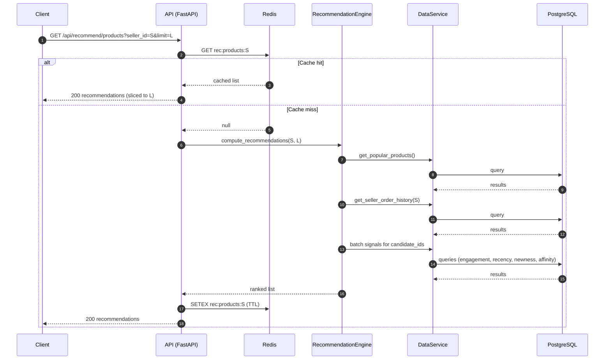
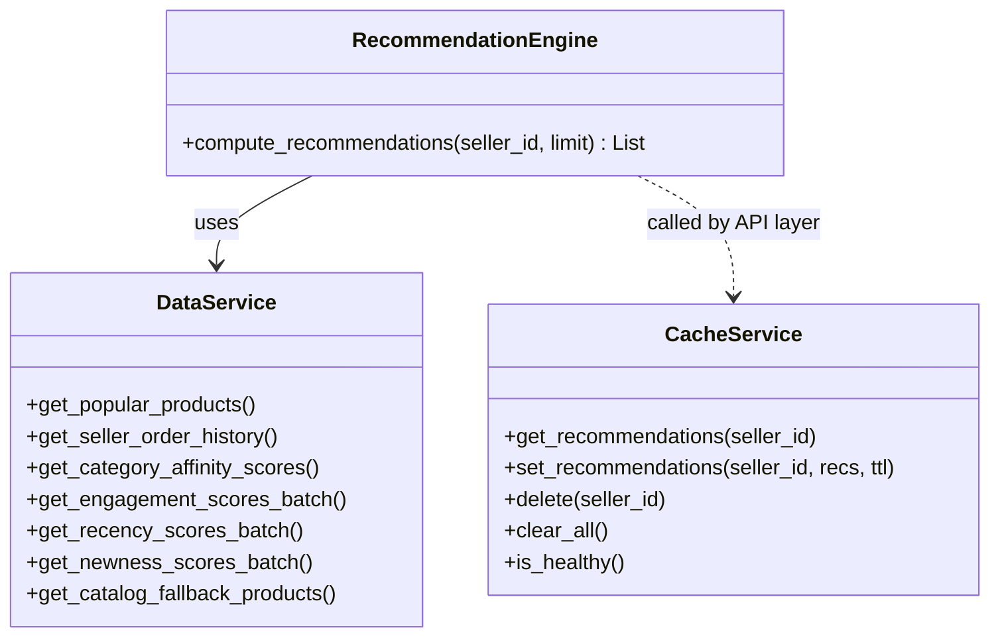

# Diagrams (Mermaid)

## Architecture image

Standalone SVG image:
- [recommendation-architecture.svg](/home/aymane/TrackA-1/docs/recommendation-architecture.svg)

## Component diagram

## Sequence diagram (GET /products)

## “Class diagram” (logical modules)

